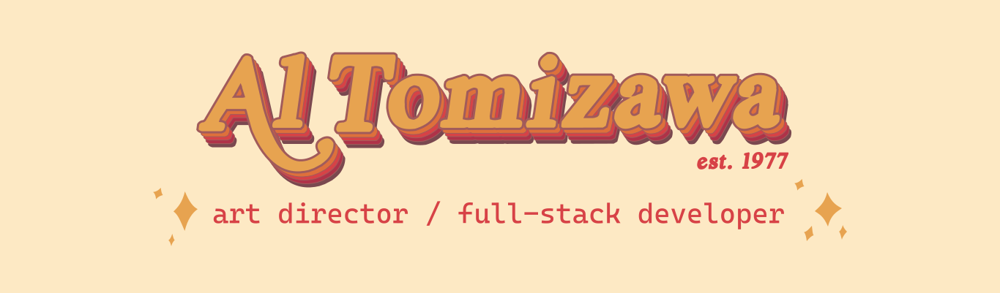

 

.

### I'm a senior Art Director/Designer who can code.
(I'm also a CrossFit Box Owner, my wife's personal chef and my daughter's Uber driver )

#

 
 

  - Worked at advertising agencies in [NY](https://www.bartleboglehegarty.com/new-york) and [LA](https://www.tbwachiatdayla.com/) creating campaigns for brands like Playstation, JBL, Whiskas, etc.

  - Opened one of the first CrossFit Boxes in Brazil

What I'm up to now:🌱🌱
-
  - I finished Triple Ten's Web Developer course and trying to improve my coding skills because it's fun and challenging

Fun Facts:⚡⚡
-
  - I'm very good at Photoshop. [Here's an image](https://www.instagram.com/p/CZdjcets-qA/?utm_source=ig_web_copy_link&igsh=MzRlODBiNWFlZA==) of my daughter's dream of a sausage in a bathtub (she was only 6 at the time)
  - [I'm probably the first CrossFitter](https://www.instagram.com/p/BXqbBkjBOeo/?utm_source=ig_web_copy_link&igsh=MzRlODBiNWFlZA==) in Brazil (started in 2008)

---

### Development Tools

        
 

#

### Design Tools

 

#

### Other Tools I know

  

          
          
<!--
**altomizawa/altomizawa** is a ✨ _special_ ✨ repository because its `README.md` (this file) appears on your GitHub profile.

Here are some ideas to get you started:

- 🔭 I’m currently working on ...
- 🌱 I’m currently learning ...
- 👯 I’m looking to collaborate on ...
- 🤔 I’m looking for help with ...
- 💬 Ask me about ...
- 📫 How to reach me: ...
- 😄 Pronouns: ...
- ⚡ Fun fact: ...
-->
