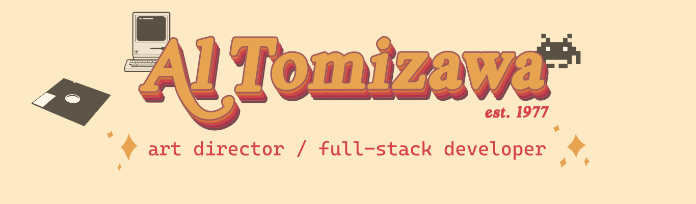

 

.

### I'm a senior Art Director/Designer who can code.
(I'm also a CrossFit Box Owner, my wife's personal chef and my daughter's Uber driver )

#

 
 
 
 
 

  - Worked at advertising agencies in [NY](https://www.bartleboglehegarty.com/new-york) and [LA](https://www.tbwachiatdayla.com/) creating campaigns for brands like Playstation, JBL, Whiskas, etc.

  - Opened one of the first CrossFit Boxes in Brazil

 
 
 
 
 

  - I finished Triple Ten's Web Developer course and trying to improve my coding skills because I love solving problems

 
 
 
 

  - I'm very good at Photoshop. [Here's an image](https://www.instagram.com/p/CZdjcets-qA/?utm_source=ig_web_copy_link&igsh=MzRlODBiNWFlZA==) of my daughter's dream of a sausage in a bathtub (she was only 6 at the time)
  - [I'm probably the first CrossFitter](https://www.instagram.com/p/BXqbBkjBOeo/?utm_source=ig_web_copy_link&igsh=MzRlODBiNWFlZA==) in Brazil (started in 2008)

 
 
 

### DEVELOPMENT TOOLS

        
 

#

### DESIGN TOOLS

 

#

### OTHER TOOLS I KNOW

 
 
 
 
 
 
 

# MAIN PROJECTS

### 1. ITALIA RESTAURANT DELIVERY APP

### Skills:
Design, Frontend, Backend, Database

### Github Repository:
FRONTEND: https://github.com/altomizawa/food-ordering_frontend
 
BACKEND: https://github.com/altomizawa/food-ordering_backend

### Live view:
To view the live website, visit: www.italianrestaurant.fairuse.org
  username: chucknorris@gmail.com   password: 123456
 
Or create an account

### Screenshots:
#
 
 

---

### 2. PERSONAL ART DIRECTOR PORTFOLIO
### Skills:
Design, UX, UI, Frontend Development

### Github Repository
https://github.com/altomizawa/als-portfolio

### Live view:
To view the live website, visit: https://alsportfolio.netlify.app/

### Demo Video (DESKTOP):
#
 
 

https://github.com/altomizawa/altomizawa/assets/45319659/bac9160e-13a2-40b0-8a26-b959192c9d3f

 

### Screenshots (MOBILE):
#
 
 

 
---

### 3. SCROLLTRIGGER WITH VANILLA JS
### Skills:
Design, UX, UI, Frontend Development, Javascript

### Github Repository:
https://github.com/altomizawa/scrolltrigger_vanillajs

### Video Demo:

https://github.com/user-attachments/assets/a8c96677-8232-471a-a9c8-732529082458

### Screenshots:
#
 
 

 
---

### 4. KOR CROSSFIT LEADERBOARD

### Skills:
Design, Frontend, Backend, Database

### Github Repository:
FRONTEND: https://github.com/altomizawa/open2024_leaderboard
 
BACKEND: https://github.com/altomizawa/open2024_leaderboard_backend

### Live view:
To view the live website, visit: https://korleaderboardopen2024.netlify.app/
  username: chucknorris@gmail.com   password: AT77at77
 
Or create an account

### Screenshots:
#
 
 

 
---

# LET'S GET IN TOUCH

<a href="https://wa.me/5561998133337"> Whatsapp</a>
 
 
 
<a href="mailto:alyssontomizawa@hotmail.com?subject=Let's talk business"> Email</a>

